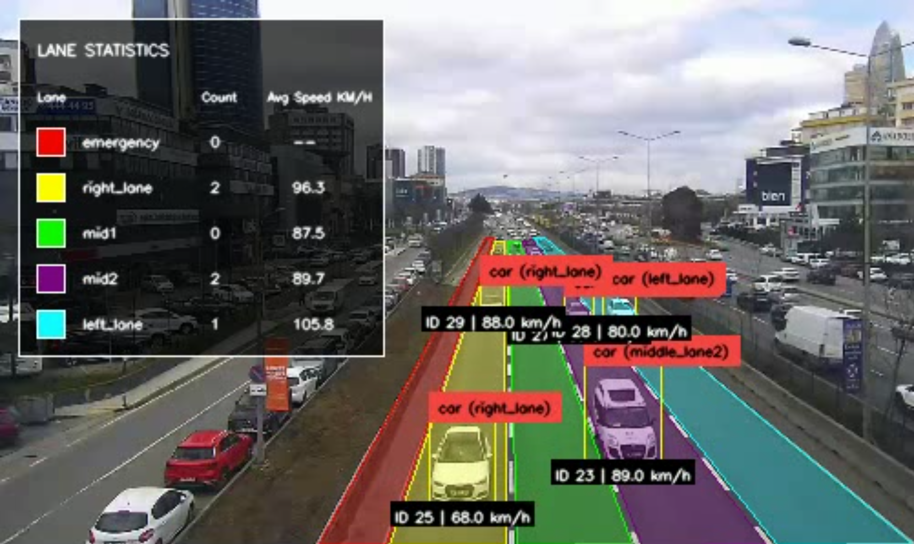
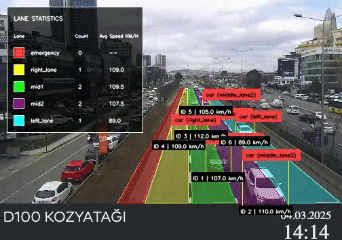

# Traffic-Analysis-With-Detetcion-and-Tracking

## Interface

Here is the visualization interface:

<p align="center">
  
</p>

## Demo

Below is a sample traffic analysis result:

<p align="center">
  
</p>


## Installation
### 1. Install PyTorch (CUDA 11.8) or your version

```
pip3 install torch torchvision torchaudio --index-url https://download.pytorch.org/whl/cu118
```

### 2. Install YOLO
1. Clone the Ultralytics YOLO repository
```
git clone https://github.com/ultralytics/ultralytics
cd ultralytics
```
2. Install the package in editable mode
```
pip install -e .
```

### 3. Install Supervision
1. Clone the Roboflow Supervision repository (develop branch)
```
git clone --depth 1 -b develop https://github.com/roboflow/supervision.git
cd supervision
```

2. Upgrade pip and install in editable mode
```
pip install --upgrade pip
pip install -e .
```

### 4. Install this Repository
1. Clone the repository:
```
git clone https://github.com/leicheng5/Traffic-Analysis-With-Detetcion-and-Tracking.git
cd Traffic-Analysis-With-Detetcion-and-Tracking
```

2. Download the YOLO model weights (or provided best.pt):
```
# Download at https://docs.ultralytics.com/models/yolo12/#detection-performance-coco-val2017
# Place your trained model weights in the project root directory
```

## Usage

Run the script in the main folder(/Traffic-Analysis-With-Detetcion-and-Tracking):

```
python main.py --source_video_path /path/to/your/video.mp4 --target_video_path /path/to/output.mp4 --source_weights_path /path/to/model/weights.pt --confidence_threshold 0.3 --iou_threshold 0.7 --display
```


## License

[MIT License](LICENSE)

## Disclaimer

This repository builds upon the original work from [Smart-Traffic-Analysis-With-Yolo](https://github.com/bahakizil/Smart-Traffic-Analysis-With-Yolo).  
The base implementation was developed by the original author, and this version contains adaptations and custom improvements to suit specific application needs.

